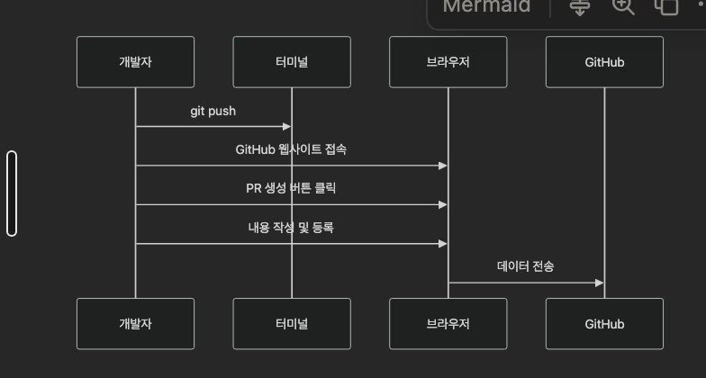
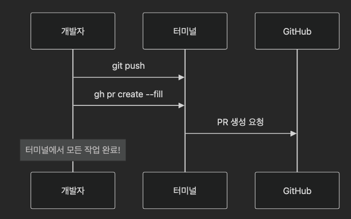

# [2025-12-23]

## ☀️ 오늘의 목표 (Scrum)

> 아침 스크럼이나 오늘 꼭 달성하고 싶은 목표를 적습니다.
>
- [ ]  목표 1
- [ ]  목표 2 

## 📝 배운 내용 (Today I Learned)

## 주제 1 gh CLI란?
Github CLI(gh)는 github의 공식 명령줄 도구.
- 웹브라우저를 통한 작업을 보다 쉬게 cli를 통해 높은 생산력을 만들어줌.


```bash
# 로그인 세팅 
gh auth login
gh auth status
```
```bash
gh repo create
#이후에 대화형으로 필요한 정보를 받아감
```
```bash
# "공개(Public)" 저장소를 만들고, 설명도 넣고, 내 컴퓨터에 복사까지 한 번에!
gh repo create my-project --public --description "My project" --clone
```

**자주 쓰는 옵션 설명**
| 옵션 | 설명 |
| --- | --- |
| `--public` / `--private` | **공개 여부**: 누구나 볼 수 있게 할지(Public), 나만 볼 수 있게 할지(Private) 정합니다 |
| `--clone` | 생성 후 자동으로 로컬에 클론합니다 |
| `--add-readme` | **자동 다운로드**: 생성되자마자 내 컴퓨터로 가져옵니다. 이걸 안 쓰면 GitHub에만 만들어집니다 |
| `--gitignore \<템플릿\>` | **소개글 추가**: 프로젝트 대문인 [`README.md`](http://README.md) 파일을 자동으로 만듭니다 |
| `--gitignore <언어>` | **찌꺼기 무시**: 언어별로(예: Python, Node) 깃에 올리지 말아야 할 파일 목록을 자동으로 작성해줍니다 |

---
### 레포지토리 관련 gh 코드
```bash
# 형식: gh repo clone [주인]/[이름]
gh repo clone facebook/react
```

```bash
# 복사(Fork)하고 + 내 컴퓨터로 다운로드(--clone)까지 한 번에!
gh repo fork owner/repo-name --clone
```

```bash
# 정보 조회
gh repo view
```
```bash
# 브라우저에서 조회
gh repo view --web
```
```bash
# 설명 바꾸기
gh repo edit --description "새로운 멋진 설명입니다"

# 최근 수정순
gh repo list --sort updated

# 특정 언어만
gh repo list --language python

# 조직의 repo
gh repo list my-org
```
```bash
# 레포 삭제
gh repo delete owner/repo-name
```

---
### PR & Issue 관련 gh
개인적으로 왜 사용하는지 모르겠다..
다만 빠른 조회용으로는 용이할 거 같음.

만약에 팀 계정에 이미 규격화된 pr이나 issue 템플릿이 존재하고 세팅되어 있다면 gh 로 적용되는지는 확인이 필요함(아마 안될듯)

### Secret 관리
이것도 개발하면 사용하면 번거로움을 덜할 거 같다.
```bash
gh secret set API_TOKEN
gh secret set API_TOKEN --body "your-secret-value"
```
```bash
gh secret set PRIVATE_KEY < private_key.pem
```

### ⭐️⭐️⭐️실무에서 자주 쓰는 명령어⭐️⭐️⭐️
> 출처 : 
### 🌅 상황 1: 출근 후 커피 한 잔 마시며 (09:00)

터미널에서 깔끔하게 "오늘 내 할 일"만 확인하는 방법

```bash
# "나(@me)에게 할당된 이슈 목록을 보여줘"
gh issue list --assignee @me
```
### 상황 2: 동료가 "제 PR 좀 봐주세요" 라고 했을 때 (14:00)

```bash
# 1. 동료의 PR(123번)을 내 컴퓨터로 가져오기
gh pr checkout 123
# 테스트 후
git checkout main  # 원래 브랜치로 복귀
gh pr checkout 123

# 특정 PR을 브라우저에서
gh pr view 123 --web

# 2. 서버 실행해서 테스트 (예: npm start)
# ... 테스트 완료 ... 했다 치고!

# 3. 터미널에서 바로 승인 도장 쾅! 💮
gh pr review --approve --body "직접 돌려봤는데 완벽하네요! 고생하셨습니다."
```
### 상황 3: 퇴근 직전, 배포 걸어두고 집에 가고 싶을 때 (17:55)

```bash
# 내 PR이 잘 돌아가는지 실시간 감시(Watch)
gh run watch
```

> 터미널에 `✓` 체크 표시가 뜨면 안심하고 노트북 덮고 퇴근! 🏃
> 

### 추천 단축키 세팅

아래 명령어를 터미널에 복사/붙여넣기 하세요. (실무에서 진짜 많이 쓰는 조합입니다)

```bash
# 1. 내 할 일 보기 -> gh my-issue
gh alias set my-issue 'issue list --assignee @me'

# 2. 지금 브라우저에서 보기 -> gh web
# (현재 작업 중인 PR이나 이슈를 웹으로 띄움)
gh alias set web 'browse'

# 3. 빠른 PR 생성 -> gh prc
gh alias set prc 'pr create --fill'
```

## 코드 조각 공유하기 (Gist)

**상황**: "이 에러 로그 좀 봐주세요" (로그가 200줄임)

```bash
# error.log 내용을 바로 URL로 바꿔줌
gh gist create error.log
```

##
